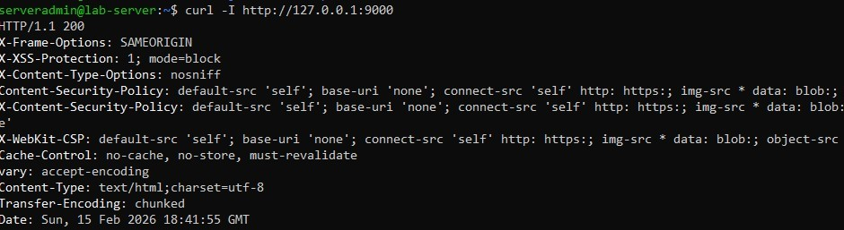
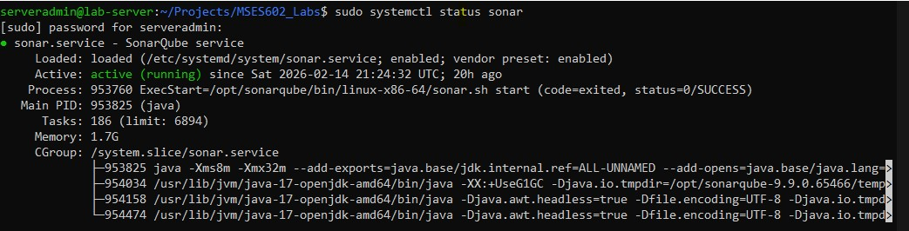
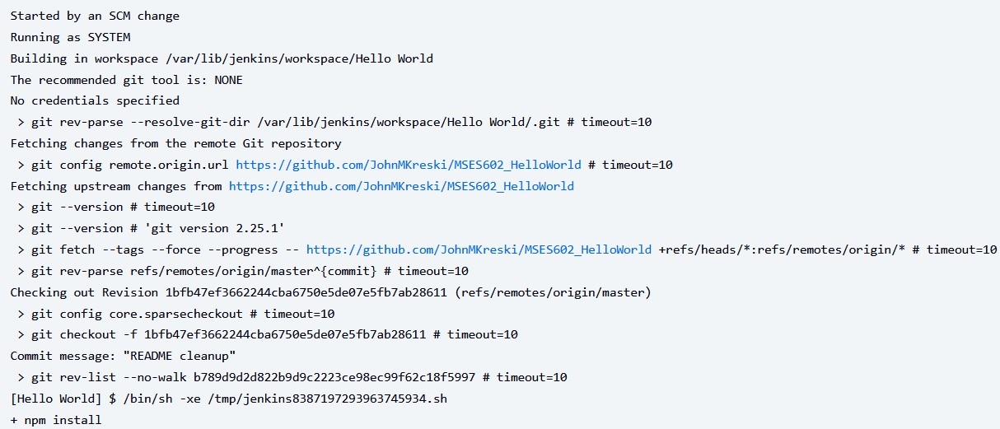
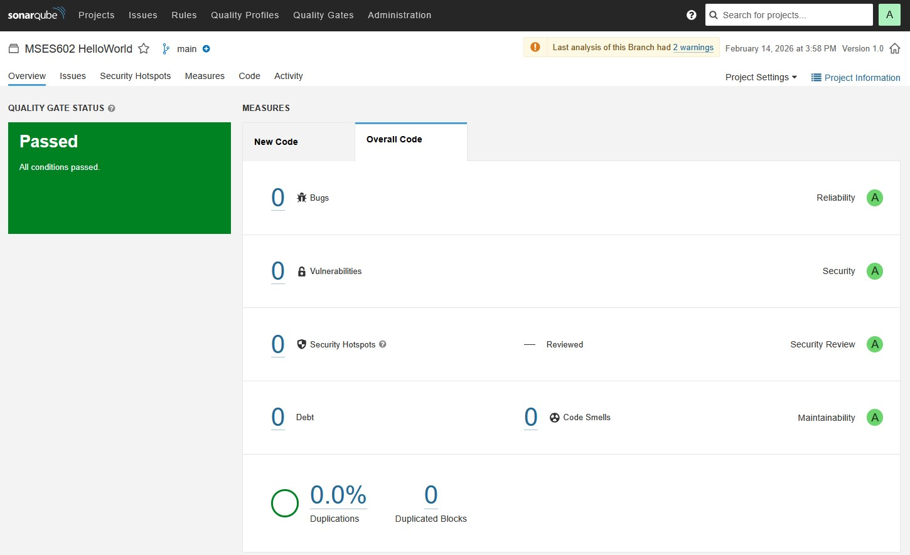
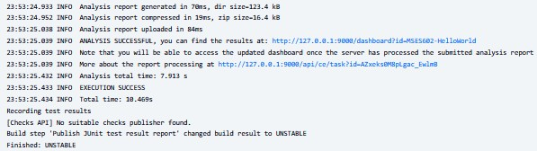
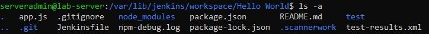
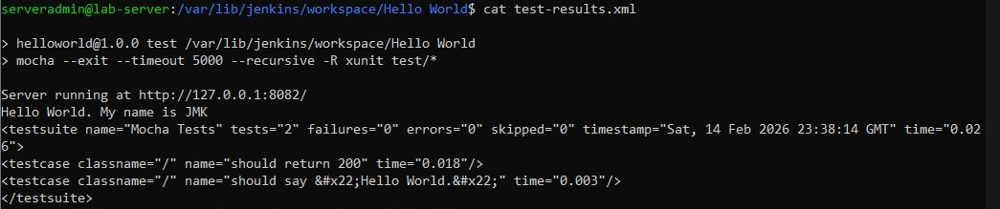

# Lab 3 – Continuous Integration with Git, Jenkins, and SonarQube

## Overview

This lab focused on implementing a basic **Continuous Integration (CI)** workflow by connecting **GitHub**, **Jenkins**, and **SonarQube**. The goal was to observe how a code commit triggers an automated pipeline that performs dependency installation, test execution, and static code analysis.

Unlike Lab 2, which centered on provisioning infrastructure with Ansible, this lab emphasized automated validation of application code after changes are pushed to source control. The objective was not only to complete a successful build, but also to interpret build results and identify quality signals surfaced by the pipeline.

---

## Environment and Setup

* [Ubuntu Server](../system.md) (headless)
* Jenkins running as a systemd service (installed via Ansible in [Lab 2](labs/lab02/lab2.md))
* SonarQube installed and configured from [Lab 2](labs/lab02/lab2.md)
* Forked GitHub repository: [`MSES602_HelloWorld`](https://github.com/JohnMKreski/MSES602_HelloWorld)
    * Original Class Repo: [`MSES602_HelloWorld`](https://github.com/RegisDevOps/MSES602_HelloWorld)
* Node.js environment available on the Jenkins host

All work was performed via SSH, Jenkins, and SonarQube web interface access.

---

# SonarQube Installation and Playbook Adjustments

Before this CI workflow could function, SonarQube had to be installed and configured from the Lab 2 using Ansible automation. [View SonarQube Playbook Here](labs/lab02/playbooks/sonarqube.yml)

### Playbook Enhancements

The following modifications were made to the Lab 2 playbooks to support SonarQube:

* Installed required Java runtime (Sonar dependency)
* Downloaded and configured SonarQube server
* Configured service permissions and ownership
* Ensured SonarQube runs on port `9000`
* Verified service startup and systemd integration

Special attention was given to:

* Proper package installation order (Java before Sonar)
* Service enablement at boot
* Local firewall/network accessibility
* Validating SonarQube availability in browser

SonarQube was confirmed accessible at:

```
http://127.0.0.1:9000
```
>Curl IP Address Check
>
>Active Service Check
>


This provisioning work enabled Jenkins integration in this lab.

---

# Git Push and Continuous Integration Trigger

Changes were committed locally and pushed to the forked GitHub repository connected to the Jenkins job.

Within the project directory:
```
/home/serveradmin/Projects/MSES602_HelloWorld
```

The standard Git workflow was used:

```
git status
git add .
git commit -m "Descriptive commit message"
git push origin master //See NOTE BELOW
```

Once the changes were pushed to the remote repository, Jenkins detected the update through SCM polling. Because polling was configured, Jenkins periodically checked the repository for changes and automatically triggered a new build when a new commit was detected.

The CI pipeline then executed the configured build stages:
* Checked out the latest revision from the remote repository
* Installed project dependencies
* Executed automated tests
* Performed static code analysis using SonarQube

This sequence demonstrates how a push to a version-controlled repository initiates an automated validation cycle. SCM polling acts as the trigger mechanism, allowing Jenkins to continuously monitor the repository and enforce build and quality checks without manual intervention.

> **Note:** In this lab environment, changes were pushed directly to the `master` branch to clearly demonstrate CI automation behavior.
> In real-world development environments, standard practice typically involves pushing changes to a feature branch and opening a Pull Request (PR). CI pipelines then execute on the PR before changes are merged into a protected `main` or `master` branch.
>  This approach enforces code review, branch protection rules, and automated quality gates prior to integration.


# Jenkins Build Execution

The Jenkins job output confirmed:

```
Started by an SCM change
```

The build process performed the following steps:

* Checked out the latest revision from GitHub
* Executed `npm install`
* Ran `npm test`
* Executed SonarScanner analysis
* Attempted to publish JUnit test results



---

# SonarQube Static Analysis

SonarScanner successfully analyzed the project and uploaded results to the SonarQube server.

Console output confirmed:

```
ANALYSIS SUCCESSFUL
EXECUTION SUCCESS
```

The project dashboard was visible in the Sonar UI.



This verified:

* Jenkins-to-Sonar connectivity
* Successful project indexing
* Static analysis execution
* Quality data publication

---

# Build Result: UNSTABLE

Although the pipeline completed successfully, Jenkins marked the build as:

```
Finished: UNSTABLE
```

This occurred due to the JUnit publishing step:

```
Build step 'Publish JUnit test result report' changed build result to UNSTABLE
```

The UNSTABLE status indicates:

* Test reports were missing, incomplete, or contained failures
* The pipeline executed but did not meet quality thresholds

Importantly, the build did not fail entirely — it surfaced quality concerns for review.



---

# Observations and Technical Findings

## Node.js Version Mismatch

SonarScanner reported:

```
Only Node.js v14.17 or later is supported, got 10.19
```

This indicates that the Jenkins host is running an outdated Node version. While the scan completed, JavaScript rules may not have executed fully.

This highlights the importance of toolchain version alignment in CI environments.

---

## Dependency Vulnerabilities

During `npm install`, the following was reported:

```
found 20 vulnerabilities (4 low, 1 moderate, 15 high)
```

This demonstrates how CI pipelines surface dependency risks early in the development lifecycle.

---

# Jenkins Workspace Review

Jenkins builds occur inside an isolated workspace located at:

```
/var/lib/jenkins/workspace/Hello World
```

The workspace contains:

* Checked-out source code  
* Installed dependencies  
* Sonar scanner artifacts  
* Build-generated files  
* Test output files (including `test-results.xml`)  



During the build process, the file `test-results.xml` was generated within the workspace. This file logged the automated test execution results and was used by Jenkins during the **Publish JUnit test result report** stage.



Reviewing this file inside the workspace provided visibility into how test outcomes are recorded and how Jenkins determines build status (e.g., `SUCCESS` vs `UNSTABLE`).

Exploring this directory reinforced how Jenkins separates build environments from developer systems while preserving detailed artifacts for validation and troubleshooting.


---

# Reflection

This lab demonstrated how Continuous Integration connects version control, automation servers, and quality analysis tools into a single feedback loop.

Key takeaways include:

* Infrastructure automation (Lab 2) enables CI workflows
* Every Git commit can trigger automated validation
* Static analysis integrates directly into the pipeline
* Quality issues are surfaced immediately
* Environment misconfiguration can impact analysis accuracy

The UNSTABLE build result was not a failure, but rather a valuable feedback signal indicating areas for improvement.

Together, Labs 2 and 3 illustrate the relationship between **provisioning tools (Ansible)** and **continuous automation platforms (Jenkins + SonarQube)** in a DevOps workflow.

---

# TODO – Improvements for Stability

* [ ] Upgrade Node.js to version 14.17 or later
* [ ] Verify and correct JUnit test report file path
* [ ] Ensure tests generate valid XML reports
* [ ] Address npm vulnerabilities (`npm audit fix`)
* [ ] Confirm latest Git commit is being built
* [ ] Re-run pipeline and validate STABLE / SUCCESS status

---

# References

* Jenkins Documentation: [https://www.jenkins.io/doc/](https://www.jenkins.io/doc/)
* SonarQube Documentation: [https://docs.sonarsource.com/](https://docs.sonarsource.com/)
* Git Documentation: [https://git-scm.com/docs](https://git-scm.com/docs)
* Node.js v10 Documentation: [https://nodejs.org/docs/latest-v10.x/api/index.html](https://nodejs.org/docs/latest-v10.x/api/index.html)
    * Node.js v25 Documentation: [https://nodejs.org/en/docs](https://nodejs.org/en/docs)


---

## AI Additional Tools

ChatGPT and Microsoft Copilot were used as supplemental tools for troubleshooting, documentation refinement, and clarification of CI/CD concepts, consistent with modern DevOps workflows.

* OpenAI, ChatGPT: [https://openai.com/chatgpt](https://openai.com/chatgpt)
* Microsoft Copilot: [https://learn.microsoft.com/en-us/copilot/](https://learn.microsoft.com/en-us/copilot/)
