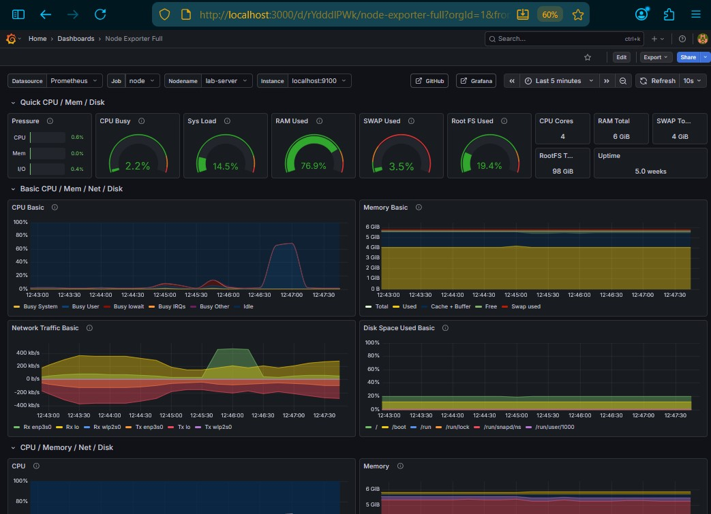
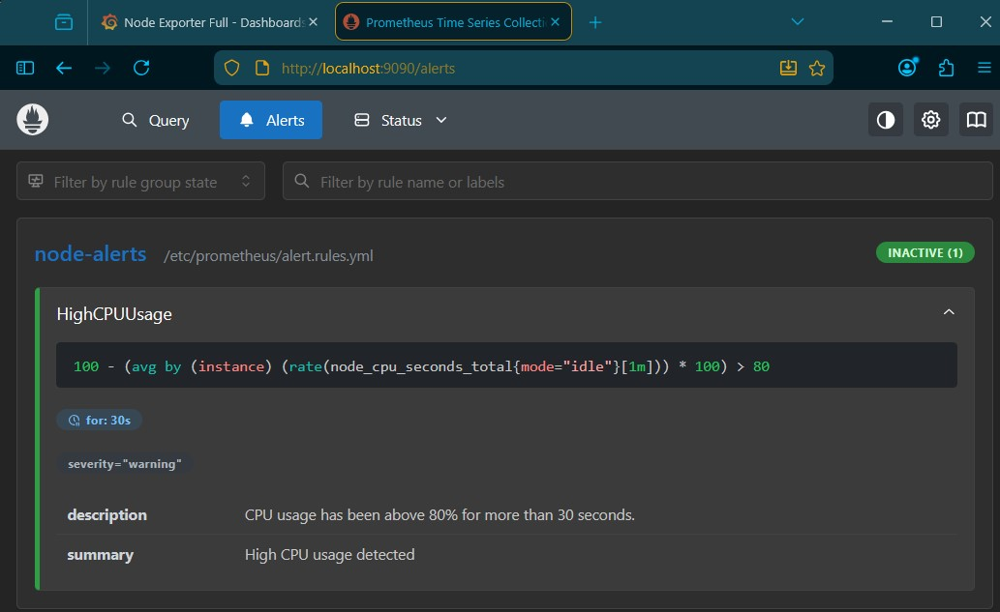
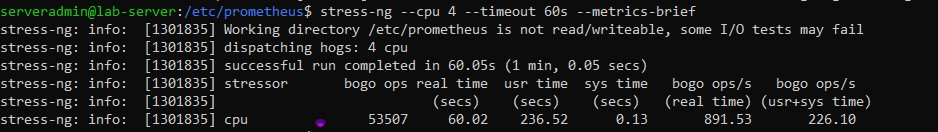
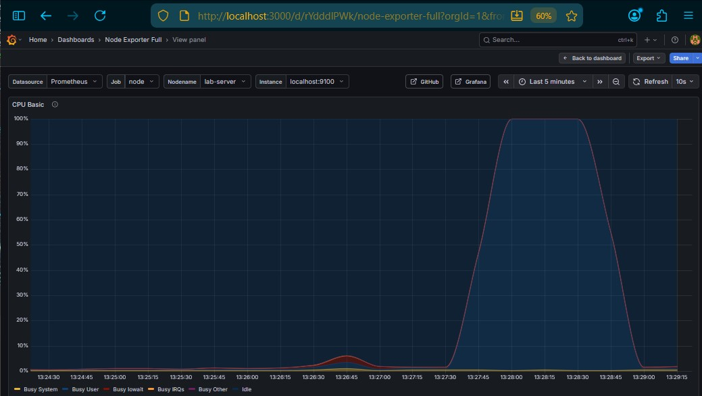
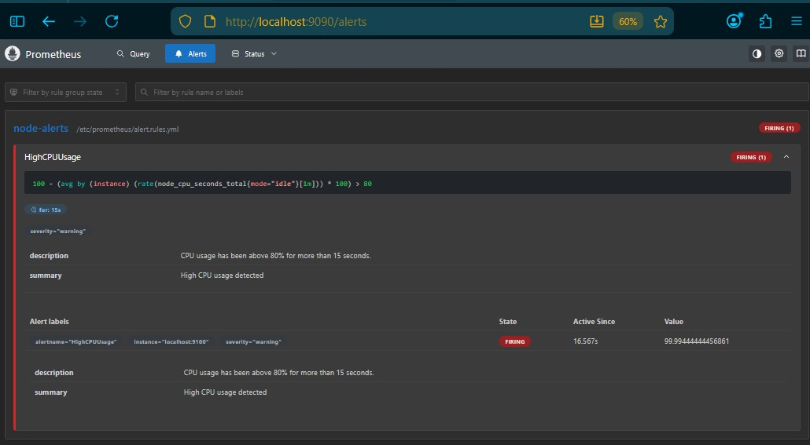

# Lab 4 – Infrastructure Monitoring Implementation

---

## Overview

This lab focused on the practical implementation of a self-hosted infrastructure monitoring stack rather than a purely research-driven comparison of commercial tools. While vendor research provides useful theoretical context, real operational understanding is gained by installing, configuring, testing, and validating monitoring systems in a live environment.

The objective of this implementation was to deploy a lightweight, production-relevant monitoring architecture on a dedicated bare-metal Ubuntu Server and validate its functionality through controlled stress testing and alert rule evaluation.

---

# Environment Context

## Host System

* Platform: Bare-metal [Ubuntu Server](../system.md) (headless)
* CPU: 4 physical cores
* Memory: ~6 GB RAM
* Disk: ~81 GB available
* Access: Headless via SSH
* Firewall: UFW installed but inactive

The system was intentionally left in a minimal state to replicate a small production-style server rather than a classroom virtual machine.

---

# Monitoring Architecture

The deployed monitoring stack consists of three primary components:

1. **node_exporter** – Exposes infrastructure-level metrics
2. **Prometheus** – Scrapes metrics and stores time-series data
3. **Grafana** – Visualizes metrics via dashboards

Logical flow:

```
node_exporter (port 9100)
        ↓
Prometheus (port 9090, localhost bound)
        ↓
Grafana (port 3000, localhost bound)
```

All services were installed directly on the host and managed via systemd.

---

# Phase 1 – Infrastructure Monitoring Deployment

## node_exporter Installation

node_exporter was installed from official binaries and configured as a systemd service.

Validation steps:

```bash
curl http://localhost:9100/metrics | head
sudo systemctl status node_exporter
```

Result:

* Service active and running
* Metrics endpoint responding
* Port 9100 listening

---

## Prometheus Installation

Prometheus was installed from official binaries and configured to scrape localhost:9100.

Scrape configuration:

```yaml
global:
  scrape_interval: 15s
  evaluation_interval: 15s

scrape_configs:
  - job_name: "node"
    static_configs:
      - targets: ["localhost:9100"]
```

Validation:

```bash
curl http://127.0.0.1:9090/-/ready
```

Result:

* Prometheus health endpoint returned ready
* Target status showed node_exporter as UP

---

## Grafana Installation

Grafana OSS was installed via the official APT repository and configured to bind to localhost.

Binding configuration:

```ini
[server]
http_addr = 127.0.0.1
http_port = 3000
```

Access method:

SSH port forwarding was used to access Grafana securely without exposing port 3000 to the LAN.

Prometheus was added as a data source using:

```
http://127.0.0.1:9090
```

---

# Dashboard Validation

The "Node Exporter Full" dashboard (ID 1860) was imported.

Observed metrics included:

* CPU utilization
* Load average
* Memory usage
* Disk usage
* Network throughput
* Uptime

Stress testing confirmed real-time responsiveness.

>

---

# Phase 2 – Alert Rule Implementation

## CPU Alert Rule

An alert rule was created to detect sustained high CPU usage.

Initial rule (production-style):

```yaml
groups:
  - name: node-alerts
    rules:
      - alert: HighCPUUsage
        expr: 100 - (avg by(instance) (rate(node_cpu_seconds_total{mode="idle"}[1m])) * 100) > 80
        for: 30s
        labels:
          severity: warning
        annotations:
          summary: "High CPU usage detected"
          description: "CPU usage above 80% for more than 30 seconds."
```

>

For demonstration reliability, the rule was adjusted to:

```yaml
expr: 100 - (avg by(instance) (irate(node_cpu_seconds_total{mode="idle"}[30s])) * 100) > 80
for: 15s
```

This improved responsiveness during lab testing.

---

# Alert Lifecycle Validation

Stress testing performed using:

```bash
stress-ng --cpu 4 --timeout 60s --metrics-brief
```
>

Observed state transitions:

1. Inactive
2. Pending
3. Firing
4. Resolved (after load removal)

This validated:

* Rule evaluation timing
* State transition logic
* Interaction between scrape interval and evaluation interval

## Grafana Dashboard Showing CPU Spike

>

## Prometheus Dashboard Showing Rule Firing

>

---

# Security Considerations

* Prometheus bound to 127.0.0.1
* Grafana bound to 127.0.0.1
* Access via SSH tunnel
* No monitoring ports exposed to LAN

This reduced attack surface while maintaining full functionality.

---

# Operational Observations

1. Multi-core CPU averaging affects alert behavior.
2. Scrape intervals directly impact alert responsiveness.
3. Sustained load duration must exceed both evaluation window and "for" threshold.
4. Monitoring services introduce minimal resource overhead (~500 MB RAM total).
5. Proper binding strategy is critical when host firewall is inactive.

---

# Real-World Implementation Rationale

While commercial SaaS monitoring platforms provide rapid onboarding, self-hosting the stack provided deeper insight into:

* Time-series database behavior
* PromQL construction
* Alert evaluation mechanics
* Service binding decisions
* Resource planning
* Operational testing methodology

This implementation mirrors real-world DevOps workflows where infrastructure ownership and observability engineering require practical understanding beyond vendor documentation.

---

# Conclusion

This lab successfully deployed a self-hosted infrastructure monitoring stack consisting of node_exporter, Prometheus, and Grafana. The system was validated through controlled stress testing and alert lifecycle verification.

The implementation demonstrated that effective monitoring requires more than dashboards—it requires understanding data collection models, evaluation timing, and alert state transitions.

The infrastructure monitoring phase is complete and provides a stable foundation for future expansion into application-level metrics and alert routing via Alertmanager.

---

# References

* How to Install Prometheus System Monitoring Tool on Ubuntu 20.04: [https://www.howtoforge.com/how-to-install-prometheus-on-ubuntu-20-04/](https://www.howtoforge.com/how-to-install-prometheus-on-ubuntu-20-04/)
* How to Set Up Prometheus and Grafana on Ubuntu: A Step-by-Step Guide: [https://tecadmin.net/how-to-setup-prometheus-and-grafana-on-ubuntu/#google_vignette](https://tecadmin.net/how-to-setup-prometheus-and-grafana-on-ubuntu/#google_vignette)
* Prometheus Documentation: [https://prometheus.io/docs/](https://prometheus.io/docs/)
    * Prometheus GitHub Repo: [https://github.com/prometheus/prometheus/](https://github.com/prometheus/prometheus/)
    * Prometheus Node Exporter Documentation: [https://prometheus.io/docs/guides/node-exporter/](https://prometheus.io/docs/guides/node-exporter/)
    * Node_Exporter Releases [https://github.com/prometheus/node_exporter/releases](https://github.com/prometheus/node_exporter/releases)
* Grafana Documentation: [https://grafana.com/docs/](https://grafana.com/docs/)
    * Grafana Labs's package repository [https://packages.grafana.com/](https://packages.grafana.com/)
* stress-ng Documentation: [https://manpages.ubuntu.com/manpages/latest/man1/stress-ng.1.html](https://manpages.ubuntu.com/manpages/latest/man1/stress-ng.1.html)
* Ubuntu Server Documentation: [https://ubuntu.com/server/docs](https://ubuntu.com/server/docs)


---

## AI Additional Tools

ChatGPT and Microsoft Copilot were used as supplemental tools for troubleshooting, documentation refinement, and clarification of CI/CD concepts, consistent with modern DevOps workflows.

* OpenAI, ChatGPT: [https://openai.com/chatgpt](https://openai.com/chatgpt)
* Microsoft Copilot: [https://learn.microsoft.com/en-us/copilot/](https://learn.microsoft.com/en-us/copilot/)


---


# Next Steps for Real-World Implementation

At this stage, the monitoring stack consists of:

- node_exporter (host-level infrastructure metrics)
- Prometheus (scraping, time-series storage, and rule evaluation)
- Grafana (visualization and dashboarding)
- A functioning CPU alert rule with verified state transitions

This represents a legitimate infrastructure monitoring deployment suitable for a small production-style environment.

In a real-world operational setting, this foundation typically evolves in several directions.

## Alert Routing and Notification

Currently, alerts transition between Inactive, Pending, and Firing states within Prometheus. However, they do not generate external notifications.

A common next step is introducing Alertmanager. Alertmanager integrates with Prometheus and provides:

- Centralized alert reception from Prometheus
- Routing rules based on severity, labels, or environment
- Notification delivery (email, webhooks, Slack, etc.)
- Alert grouping and deduplication
- Silencing and maintenance windows

This moves the architecture from basic monitoring to a more complete Site Reliability Engineering (SRE) model, where alerts trigger actionable responses rather than simply changing internal state.

## Expanded Infrastructure Coverage

Additional infrastructure alerts may include:

- Disk usage thresholds
- Memory pressure detection
- Service availability checks
- Filesystem inode monitoring

These improve operational awareness and reduce mean time to detection (MTTD).

## Application-Level Monitoring

With infrastructure monitoring stable, the next logical layer is application instrumentation. This would allow correlation between:

- Host resource utilization
- Application latency
- Error rates
- Request throughput

This layered visibility provides a more complete observability posture.

## Security and Exposure Hardening

Future improvements may include:

- Enabling UFW and defining explicit inbound rules
- Introducing Nginx as a reverse proxy
- Adding TLS for encrypted dashboard access
- Implementing authentication hardening

These steps transition the stack from lab-grade to production-hardened.