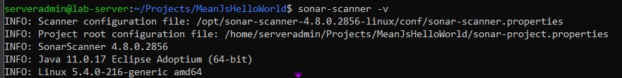
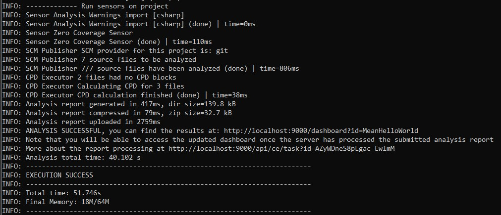
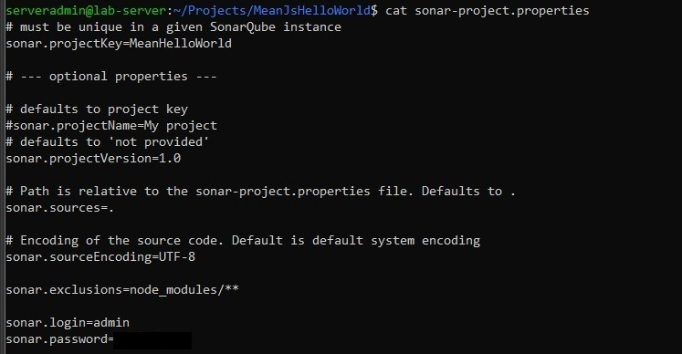
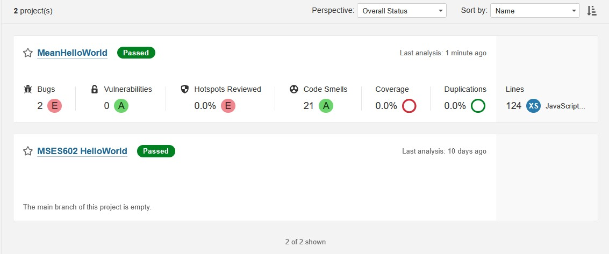
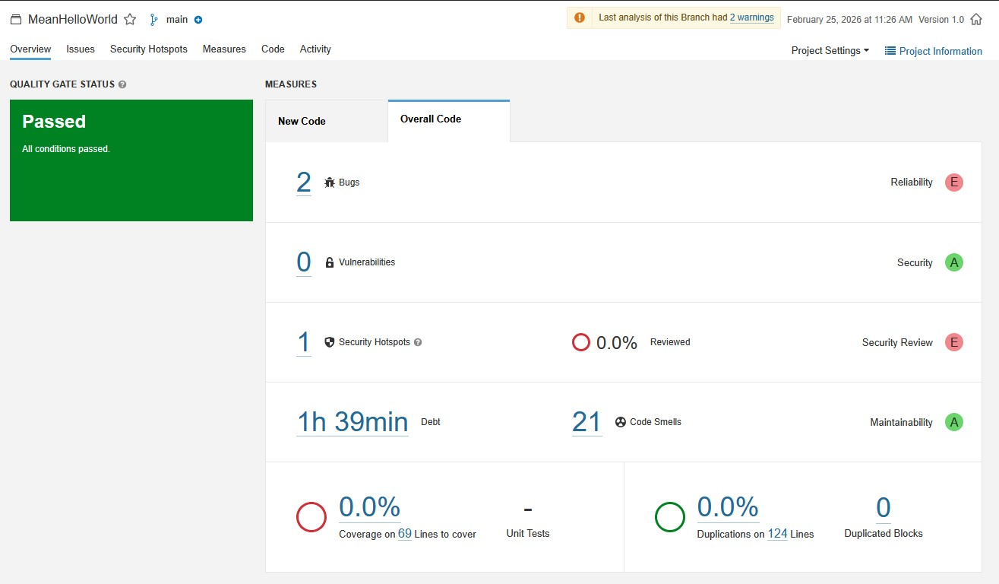
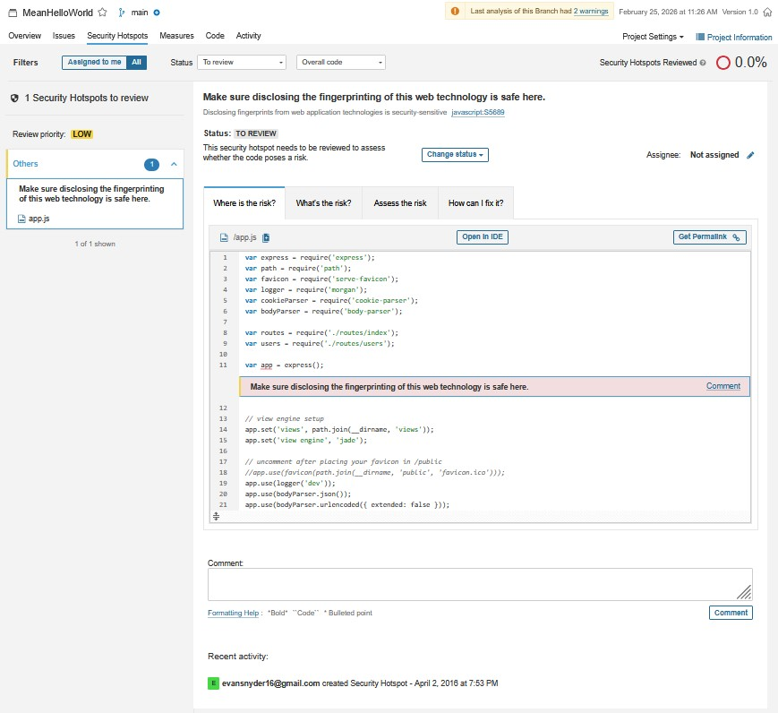

# Lab 5 – Static Analysis with SonarQube

## Overview

This lab focused on performing standalone static code analysis using SonarQube and the `sonar-scanner` CLI tool. Unlike Lab 3, where SonarQube was integrated into a Jenkins CI pipeline, this activity emphasized manual execution of static analysis against a sample project and interpreting the results surfaced in the SonarQube dashboard.

The objective was to:

* Install and verify SonarQube functionality
* Scan a sample Node/Express application
* Review identified issues (Bugs, Code Smells, Security Hotspots)
* Evaluate the role of static analysis in software quality and security

---

## Environment

* Ubuntu 20.04 (Lab [Server](../system.md))
* SonarQube 9.9.0.65466 (LTS)
* sonar-scanner CLI installed and configured
* Git installed
* Java runtime (required for SonarQube)

SonarQube was confirmed running at:

```
http://localhost:9000
```

> 

---

# Project Setup and Scan Execution

From the lab server:

```bash
cd ~/Projects
git clone https://github.com/RegisUniversity/MeanJsHelloWorld
cd MeanJsHelloWorld
```

To execute the static analysis:

```bash
sonar-scanner
```

### Scanner Output (Summary)

```
INFO: ANALYSIS SUCCESSFUL
INFO: EXECUTION SUCCESS
INFO: Analysis total time: 40.102 s
```

The scan successfully generated and uploaded the analysis report to the SonarQube server.

> 

---

# Understanding Project Configuration

The `sonar-project.properties` file defines how SonarQube scans the project.

```bash
cat sonar-project.properties
```

### Key Configuration Details

```
sonar.projectKey=MeanHelloWorld
sonar.projectVersion=1.0
sonar.sources=.
sonar.sourceEncoding=UTF-8
sonar.exclusions=node_modules/**
sonar.login=admin
sonar.password=*******
```

### Analysis of Properties

* **Project Key:** `MeanHelloWorld`
  This is the name visible in the SonarQube dashboard.

* **Source Root:** `.`
  The scanner analyzes all source files in the root directory.

* **Exclusions:** `node_modules/**`
  Prevents third-party dependencies from being scanned.

* **Encoding:** UTF-8
  Ensures proper parsing of source files.

> 

---

# SonarQube Dashboard Results

After processing, the dashboard displayed the following metrics:

| Metric            | Result                   |
| ----------------- | ------------------------ |
| Bugs              | 2                        |
| Vulnerabilities   | 0                        |
| Security Hotspots | 1                        |
| Code Smells       | 21                       |
| Coverage          | 0.0% (69 lines to cover) |
| Duplications      | 0.0%                     |
| Duplicated Blocks | 0                        |

#### SonarQube Home Dashboard
> 

#### SonarQube Project Dashboard
> 

---

## Interpretation of Results

### Bugs (2)

These indicate logical or structural issues that may cause incorrect behavior at runtime. While not necessarily security-related, they affect reliability and correctness.

### Security Hotspot (1)

In SonarQube 9.9 LTS, potential security concerns are often categorized as Security Hotspots rather than confirmed Vulnerabilities. A hotspot requires developer review to determine whether the code is exploitable.

This explains why the lab instructions referenced a Vulnerability such as:

> “Review this ‘Function’ call and make sure its arguments are properly validated.”

Under current SonarQube rule classifications, this type of issue may instead appear as a Security Hotspot requiring manual review rather than a confirmed vulnerability.

### Code Smells (21)

Code Smells indicate maintainability issues such as:

* Minor refactoring opportunities
* JavaScript best-practice violations
* Structural inefficiencies
* Readability improvements

While they do not break functionality, they increase technical debt and long-term maintenance cost.

### 0% Test Coverage

The project does not include unit tests covering executable lines of code. From a DevOps and quality standpoint, this represents a significant gap in validation and risk mitigation.

---

# Reviewing Identified Issues

Reviewing the Security Hotspot revealed:

* The location of the flagged code
* A description of the potential security concern
* Examples of non-compliant and compliant patterns

Most Code Smells appeared reasonable and related to Express route handling and JavaScript conventions.

Overall, the findings were appropriate for a minimally configured ExpressJS starter application.

> 

---

# Questions

## 1. What advantages do you see in static scanning of code?

Static scanning provides:

* Early detection of bugs before runtime
* Identification of potential security weaknesses
* Visibility into maintainability concerns
* Objective quality metrics
* Automation-ready integration into CI pipelines

It shifts quality left in the development lifecycle, reducing remediation cost and improving overall software reliability.

---

## 2. What issues might you see in always failing your CI pipeline if SonarQube identifies insufficient test cases, security issues, or bugs?

Automatically failing builds on all findings may:

* Reduce development velocity
* Frustrate developers if rules are overly strict
* Surface false positives
* Create alert fatigue

Organizations must balance enforcement with practicality. Quality gates should align with risk tolerance and team maturity rather than applying overly rigid defaults.

---

## 3. What can you learn from investigating ‘code smells’? What if you disagree? How can SonarQube be modified for your organization?

Investigating Code Smells helps developers:

* Improve readability
* Reduce technical debt
* Enforce coding standards
* Learn best practices

If a team disagrees with specific rules:

* Quality Profiles can be customized
* Rules can be disabled or severity adjusted
* Quality Gates can be tailored
* Custom rule sets can be applied

SonarQube is highly configurable, allowing organizations to align static analysis policies with internal standards and risk tolerance.

---

# Reflection

This lab reinforced the value of static analysis as an automated quality assurance mechanism. Unlike dynamic testing, static analysis inspects source code structure and patterns without executing the application.

Key takeaways:

* Static analysis surfaces quality concerns early
* Security Hotspots require human judgment
* Code coverage metrics expose testing gaps
* Configuration determines enforcement strictness
* Modern DevOps workflows benefit from integrated scanning

Together with Labs 2 and 3, this activity demonstrates how infrastructure provisioning, CI automation, and static code analysis combine to create a continuous feedback loop for software quality.

---

# References

* SonarQube Documentation: [https://docs.sonarsource.com/](https://docs.sonarsource.com/)
* SonarScanner CLI: [https://docs.sonarsource.com/sonarqube/latest/analyzing-source-code/scanners/sonarscanner/](https://docs.sonarsource.com/sonarqube/latest/analyzing-source-code/scanners/sonarscanner/)
* ExpressJS Generator: [https://expressjs.com/en/starter/generator.html](https://expressjs.com/en/starter/generator.html)

---

## AI Additional Tools

ChatGPT and Microsoft Copilot were used as supplemental tools for troubleshooting, documentation refinement, and clarification of CI/CD concepts, consistent with modern DevOps workflows.

* OpenAI, ChatGPT: [https://openai.com/chatgpt](https://openai.com/chatgpt)
* Microsoft Copilot: [https://learn.microsoft.com/en-us/copilot/](https://learn.microsoft.com/en-us/copilot/)


